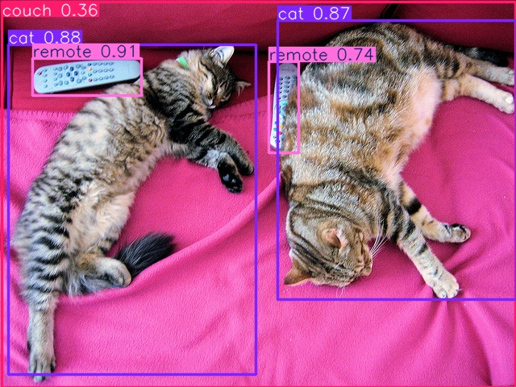
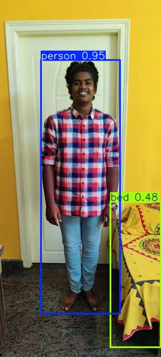
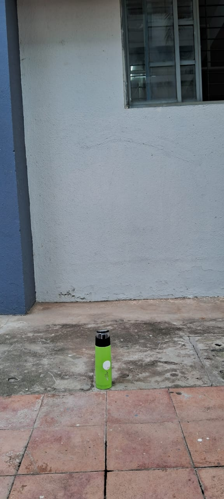
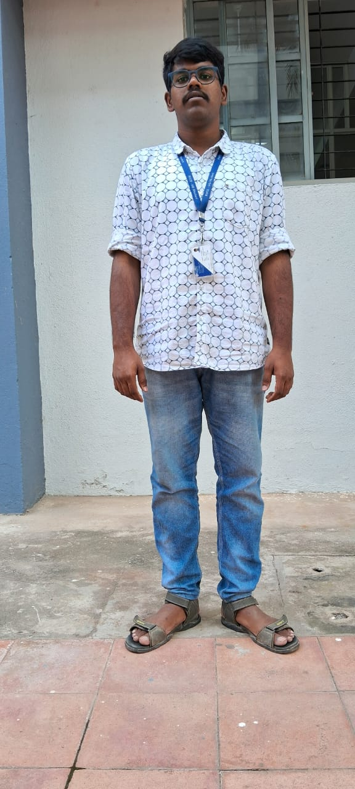
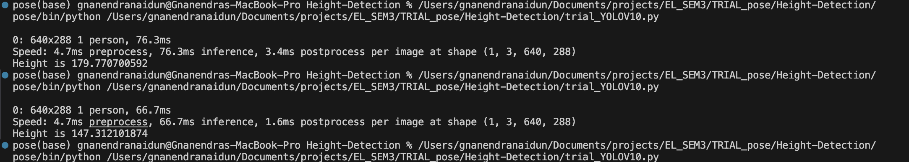

# Depth Estimation and Measurement using YOLO and Transformers

This project utilizes YOLO for object detection and a transformer-based depth estimation model to measure distances, arm span, and height of detected persons in an image.

## Requirements
- Python 3.x
- OpenCV
- Matplotlib
- Transformers (Hugging Face)
- Ultralytics YOLO
- Torch
- PIL (Pillow)
- NumPy

## Setup
1. Install the required dependencies using:
   ```sh
   pip install -r requirements.txt
   ```
2. Ensure the correct image paths are provided in the script before running.
3. All images should be stored in the `images/` directory.
4. The output results will be saved in the `runs/` directory.

## Usage
Modify the `find()` function call in the script to provide the correct path to your image.
```python
find('images/sample_image.jpg')
```

Run the script:
```sh
python modification_dpt.py
```

## Output
- Detected persons will be outlined in the processed images.
- Depth maps and distance estimations will be displayed.
- Height and arm span measurements will be calculated and printed.

## Notes
- Ensure that the `images/` folder contains the images you wish to process.
- Output results including processed images and measurement logs will be saved in the `runs/` directory.
- The script uses a fixed scaling factor to convert pixel measurements to real-world units.

## Acknowledgements
- YOLO model from Ultralytics.
- Depth estimation model from Hugging Face.

## Objects Detections
Cats detection using yolo<br>


<br>person detection<br>


## depth map


## height extimation 
fixed distance images using tripod to estimate height<br>
relative scaling factor to be set in the code for accuracy <br>
accuracy of *99.4%* achieved from this technique<br>
first bottle image to be passed to model<br>

### bottle image


then finding scaling fator and pasing the human image
### Human Img


# final result
### bottle 


### Human


## Web APP for Analysis of the results.
[Cresere-Web-App](https://github.com/gnanendranaidun/Crescere-data.git)
## Licence
This is a personal open source project.
Feel free to contribute
